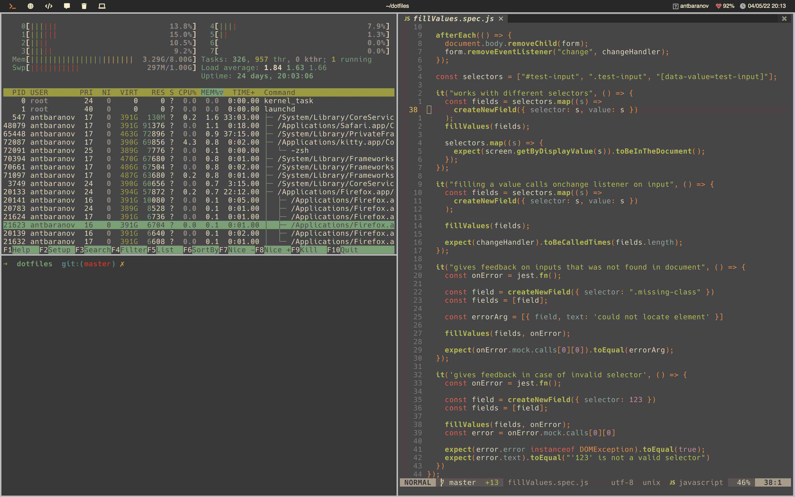

## Quick summary

- *[skhd](https://github.com/koekeishiya/skhd)* - hotkey manager 
- *[yabai](https://github.com/koekeishiya/yabai)* - tiling window manager
- *[nvim](https://neovim.io)* - text editor / IDE
- *[kitty](https://sw.kovidgoyal.net/kitty/)* - terminal emulator
- *[spacebar](https://github.com/cmacrae/spacebar)*- minimalistic replacement for default mac top bar

## Run

```bash
sh install
```
## Dependencies

- zsh
- oh-my-zsh
- fzf
- homebrew
- neovim 6.0 or later
